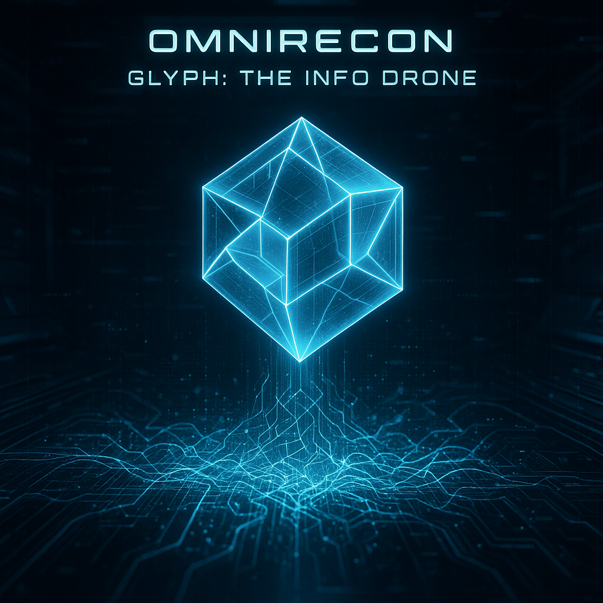
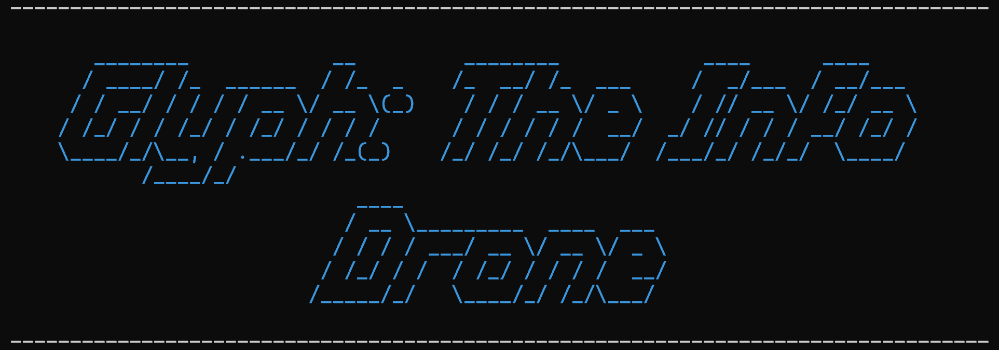

<p align="center">
  
</p>

---

# 🛰️ OmniRecon

**“Commander, Glyph Info Drone is online. Ready for reconnaissance deployment.”**

OmniRecon is a modular Bash-based reconnaissance toolkit featuring Glyph – a fictional Info Drone assistant inspired by Mass Effect’s immersive drone UIs.

This project was created as a personal learning and showcase tool, integrating:

- **Bash scripting best practices**
- Modular functions and clean structure
- Stylized prompts and outputs for immersion
- Real-world CLI reconnaissance tooling (Nmap)

---

## ✨ Features

- 🛰️ **Immersive AI Commander prompts** (Glyph AI style)  
- 🔍 **Target validation** (IPv4 and ranges)  
- 📡 **Basic reconnaissance module using Nmap** with optional flags:
  - Service version detection (`-sV`)
  - OS detection (`-O`)
  - Default scripts (`-sC`)
  - Aggressive timing (`-T4`)
  - Show only open ports (`--open`)
  - Enable very verbose output (`-vv`)
  - UDP Scan (`-sU`)
- ❌ **SIGINT handler** (Ctrl+C interruption)

---

## ⚠️ Requirements

- `bash` (at least v5.2.21(1)-release)
- `nmap` (at least v7.94SVN)
- **sudo privileges**

> **Note**: OmniRecon was developed and tested on:
> - **WSL (Ubuntu 24.04.2 LTS)**  
> - **VS Code 1.101.2** with extensions:
>   - Bash Beautify (v0.1.1)
>   - Bash IDE (v1.43.0)
>   - ShellCheck (v0.37.7)
>   - WSL Integration (v0.99.0)

---

## 🚀 Installation

```bash
git clone https://github.com/e21-AS/OmniRecon.git
cd OmniRecon
chmod +x OmniRecon.sh
```

---

## 🎨 Logo & Cover Credits

### 🤖 Cover

The OmniRecon cover image was generated using **OpenAI's DALL·E 3 model**.

**Prompt used:**

> "A stunning 8K ultra-detailed sci-fi desktop wallpaper. In the center, a glowing, translucent blue holographic projection of a geometric data drone, similar to Glyph from Mass Effect, is shown intensely analyzing a complex, abstract network topology or data stream. The drone emanates soft neon blue and white light, casting reflections on a sleek, dark cybernetic interface in the background. Subtle binary code flows and digital glitch effects add to the high-tech atmosphere. The overall aesthetic is clean, futuristic, and highly analytical. Text overlay: "OMNIRECON" and "GLYPH: THE INFO DRONE" in a sharp, futuristic font. --ar 16:9 --style raw"

© 2025 e21-AS. Cover generated using Glyph’s external image synthesis module (DALL·E 3).


### 💾 ASCII Logo

<p align="center">
  
</p>

The above is a screenshot captured directly from terminal output upon script initialization.
The logo was generated using `figlet`:

> `figlet -f slant "Glyph: The Info Drone"`

---

## ⚠️ Disclaimer

OmniRecon is intended for **educational and authorized security testing purposes only**.  
The author is **not responsible for any misuse** of this toolkit.

---